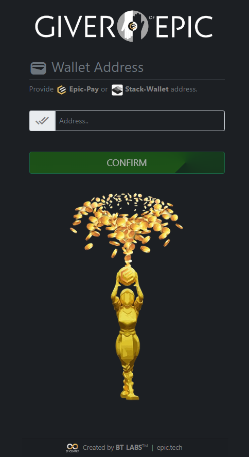

{: .round .center}

> - [**:fontawesome-brands-github-square: GitHub :octicons-link-external-16:**](https://github.com/blacktyger/giverofepic) - Open-source code of the project
> - [**:material-web: Faucet App :octicons-link-external-16:**](https://giverofepic.com/) - BETA web application with crypto faucet
> - Developers: [**@blacktyg3r**](https://t.me/blacktyg3r) | [**@RichardMace**](https://t.me/RichardMace)
> - Status: **v1** in production, **v2** in development
----

## **Abstract**
The Initial goal of the project was to deliver cryptocurrency faucet script build on the **EPIC blockchain**. 
Beta version is live and available at [**GiverOfEpic.com**](https://giverofepic.com), where everyone can receive fraction of 
the EPIC coin via **Epic-Pay** or **Stack-Wallet** mobile apps.

{: .round .center .img-alt-text style="height:450px"}

Web Application

## **More than faucet**

Project's back-end is powered by [**EPIC PythonSDK**](https://github.com/blacktyger/epic-py) 
developer's package to manage epic-wallet CLI with the Python programming language.
It also uses custom [RUST library](https://github.com/blacktyger/epic-wallet-rust-python) 
to work with EPIC mobile wallets (using epic-post protocol until epic-box standard will be officially integrated).

Armed with this tool **Giver Of Epic** can be more than just a cryptocurrency faucet, 
in the next release it will be a framework - **E**pic **G**iveaway **D**istribution **S**ystem, **EGDS** will help 
with distribution of the EPIC rewards during events and happenings within the **EPIC Community**.

### **EDGS** Key points:
- Easy to use for non-tech users
- Script management via online web-app
- Automation of the giveaway process
- Multiple online wallets available to reward or share EPIC with others

For incoming release (v2) I want to focus on 2 main features of the EGDS:

- Integrations with [forms.app](https://forms.app) quiz to automate reward distribution
- **Giveaway Links** system, generate and share links to claim EPIC

---

## Giveaway Links Overview

When generating new link it can be:

- **Personal** or **In Blanco**:
    By default generator will be set to `personal` mode and will require to provide receiver `address`.  
    Switching off `personal` will make transaction possible to claim by anyone, 
    `address` field is then ignored and can be lefty empty.
    - **personal**, means only specified wallet can receive transaction, even if link is visited and claimed by someone else,
    - **in blanco** links on the contrary are issued without specified receiver, whoever first will claim it gets the coins.

- **One-time** or **Reusable**:
    - if `reusable` argument is set to `0` transaction will be considered as **one-time** use, 
      after success claim it will be marked as `claimed` in the database,
    - otherwise link can be used exactly that many times as specified in `reusable` 
      but no more than `10` (this can and most likely will change). 
      Script will keep track of every claim and will adjust database records.

Each  link will require `event` (name) and `amount` fields to be specified, also will have an expire date, default `expire` is set to `60 minutes` but can be easily change. 

Rest of the arguments are already filled, some impossible to change by admins, hardcoded.

Both of the features are working similar under the hood - users can claim the reward 
with unique `URL link` to visit or `CODE` to provide when `giverofepic.com` website visited, but
there is a difference in the way of generating those links.

!!! note "Quiz links (generated automatically)"
    Codes generated automatically after finished quiz via [forms.app](http://forms.app) web-app 
    managed by community member. This will be example of **one-time personal** link, can be claimed only once by person with access to special code, `form_id`.

    **Workflow**:

     - [forms.app](http://forms.app) is sending notification to the script after each successful quiz form submission 
       via webhook, we get the `form_id`, `user_id` and number of `points` from quiz data.
     - script will save that data in the local database and will use later for authorization and calculations of the reward.
     - user at the end of the quiz can copy `form_id` and claim coins by visiting [giverofepic.com/quiz](http://giverofepic.com/quiz) link

!!! tip "Giveaway links (generated by people)"
    Links generated for special events, highly customizable. This could be an example of **in blanco reusable** link - 
    i.e.  during the show or event we can issue one link and first 10 people to claim it will be rewarded, 
    then link expires and is unusable. We can also issue **one-time personal** links for specific users 
    using their wallet address. In any case user will get a friendly and relatively short URL like:

    > **giverofepic.com/claim/TW5-a3ff$&gy54**

    where `TW` would be place for event name or place shortcut (i.e. `TW` for Twitter, `UV` for Uncle Vigilante show etc.), 
    following `5` would be indicating how much coins can be claimed with this link and after `-` 
    we got securely generated unique identifier for script to make sure links are valid. 
    The user readable part (`TW5`) won’t really mean anything for the script, it is purely cosmetic to make it more friendly for humans.
    
    #### How to generate links:
      1. Login to admin account, i.e. `www.giverofepic.com/admin`
      2. Go to Key Generator tab
      3. Click create new link
      4. Check and adjust custom settings
      5. Confirm and generate the link
      6. Copy link and share with the user/s

---

## Roadmap and Progress

!!! tip "Dec '22 - Feb '23 - v1 version"
    - EPIC PythonSDK package
    - RUST/Python bindings library
    - Faucet front-end (HTML/CSS/JS)
    - Faucet back-end (Python, SQLite)
    - Integration with mobile wallets

!!! todo "Feb '23 - March '23 - v2 version"
    - GDS framework concept
    - Quiz app integration
    - Giveaway links system
    - Multiple wallet instances manager
    - Front-end admin panel
