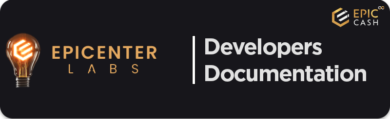

#

Project is created and managed by community made out of volunteers, same as this documentation - 
please let us know if something should be improved or added, we will do our best to make it better!

:material-file-code: As a developer you can find here how to **build**, **use** and **integrate** our software.

:material-information: For others we have useful **guides**, **articles** and **materials** explaining our technology and mission.

 

> - [**:material-web: Epic.tech Website :octicons-link-external-16:**](https://epic.tech) 
> - [**:fontawesome-brands-github: Epic-Cash GitHub :octicons-link-external-16:**](https://github.com/EpicCash) 
> - [**:material-web: Epicentral.io Website :octicons-link-external-16:**](https://epicentral.io/) 

 

### Mimblewimble & Epic-Cash tech
> - [:fontawesome-brands-github: **Mimblewimble :octicons-link-external-16:**](https://github.com/EpicCash/epic/blob/master/doc/epic4bitcoiners.md) - Explaining Mimblewimble
> - [:fontawesome-brands-github: **Overview :octicons-link-external-16:**](https://github.com/EpicCash/epic/blob/master/doc/intro.md) - Tech introduction to the EPIC
> - [:fontawesome-brands-medium: **Core software :octicons-link-external-16:**](https://blacktyg3r.medium.com/epic-cash-core-software-components-22639641448e) - Epic-Cash components
