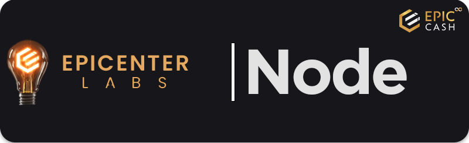

#

## Building and running EPIC node
- [**:fontawesome-brands-github: Running Epic-Cash Windows :octicons-link-external-16:**](https://github.com/EpicCash/epic/blob/master/doc/windows.org) - EPIC blockchain on Windows.
- [**:fontawesome-brands-github: Running Epic-Cash Linux :octicons-link-external-16:**](https://github.com/EpicCash/epic/blob/master/doc/running.org) - EPIC blockchain on Linux distributions.
- [**:fontawesome-brands-github: Build EPIC Node :octicons-link-external-16:**](https://github.com/EpicCash/epic/blob/master/doc/build.md) - Epic Node - Build, Configuration and Running

## Understand the EPIC Node implementation
- [**:material-web: RUST docs :octicons-link-external-16:**](https://docs.epic-radar.com/node/epic_api)
- [**:fontawesome-brands-github: Dandelion - introduction :octicons-link-external-16:**](https://github.com/EpicCash/epic/blob/master/doc/dandelion/dandelion.md) - About transaction propagation and cut-through. Stemming and fluffing!
- [**:fontawesome-brands-github: Dandelion - simulation :octicons-link-external-16:**](https://github.com/EpicCash/epic/blob/master/doc/dandelion/simulation.md) - Dandelion simulation - aggregating transaction without lock_height Stemming and fluffing!
- [**:fontawesome-brands-github: Chain Synchronization :octicons-link-external-16:**](https://github.com/EpicCash/epic/blob/master/doc/chain/chain_sync.md) - About how Epic's blockchain is synchronized
- [**:fontawesome-brands-github: Merkle - Introduction :octicons-link-external-16:**](https://github.com/EpicCash/epic/blob/master/doc/merkle.md) - Technical explanation of EPIC's favorite kind of merkle trees
- [**:fontawesome-brands-github: Merkle - Proof Graph :octicons-link-external-16:**](https://github.com/EpicCash/epic/blob/master/doc/merkle_proof/merkle_proof.png) - Example merkle proof with pruning applied
- [**:fontawesome-brands-github: Blocks and Headers :octicons-link-external-16:**](https://github.com/EpicCash/epic/blob/master/doc/chain/blocks_and_headers.md) - How Epic tracks blocks and headers on the chain
- [**:fontawesome-brands-github: Contract ideas :octicons-link-external-16:**](https://github.com/EpicCash/epic/blob/master/doc/contract_ideas.md) - Ideas on how to implement contracts
- [**:fontawesome-brands-github: Internal Pool :octicons-link-external-16:**](https://github.com/EpicCash/epic/blob/master/doc/internal/pool.md) - Technical explanation of the transaction pool
- [**:fontawesome-brands-github: Pruning :octicons-link-external-16:**](https://github.com/EpicCash/epic/blob/master/doc/pruning.md) - Technical explanation of pruning

