# EPIC Cash GUI Wallet v4.0

> Author:  :fontawesome-brands-telegram: [**Sky King**](https://t.me/epiccashhelpdesk)

## Overview
This guide is to assist you in quickly getting the Wallet App downloaded, installed, set up, and
ready to send/receive Epic Cash (EPIC). For more info on EPIC and the Epicenter
ecosystem, you can go to https://epicenter.epic.tech for a complete detailed overview of the
platform and technology. See Send/Receive Address discussion at the end of this guide.

## Obtaining the App
Go to [github release page](https://github.com/EpicCash/epic-gui-wallet/releases/) and download the
Wallet for your OS.

## Installation
Install the Wallet App as you would any other App for your particular OS.

## First Run
Once you have downloaded and installed the Wallet App, you are ready to run the Wallet for
the first time when you will create a new wallet account. The first page you see is the
Welcome page where you will select 'Create new wallet'. You can also select a different folder
location for your wallet if you don't want to use the default location (OS dependent).

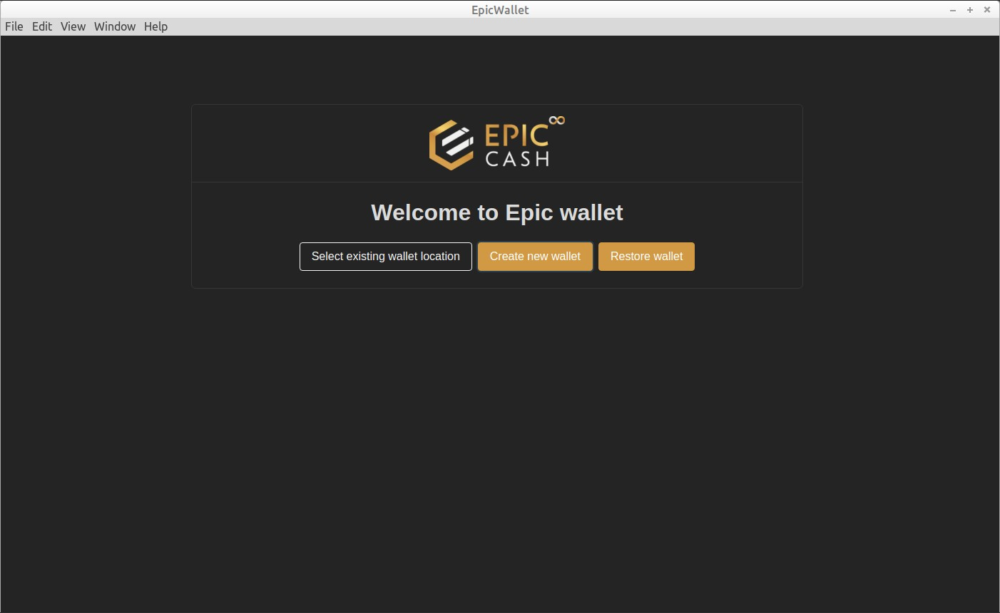

You are then presented with the Create New Wallet page where you will enter a password for
your default wallet account. Click 'Create new wallet' to continue.

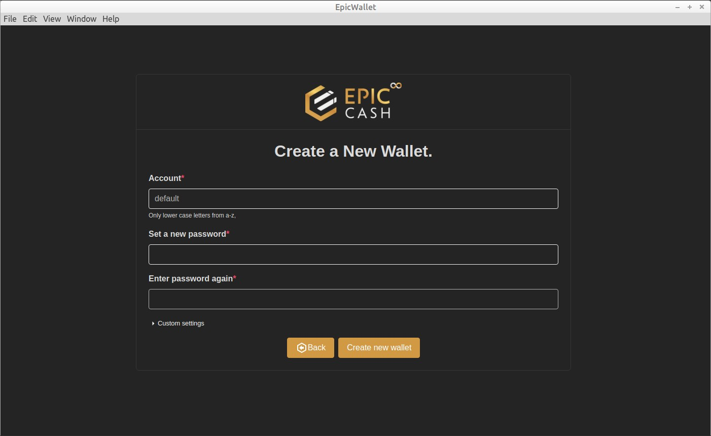

Next you will see the Seed Phrase page. You should transfer the list of words onto paper,
metal, or other physical media to store securely in case you ever need to re-create your
wallet. You can scan the QRcode to capture your phrase into your phone's clipboard then
save to media. If you have more than one account make sure you identify your seed phrase
by Account name. After securing/scanning your phrase, click Login.

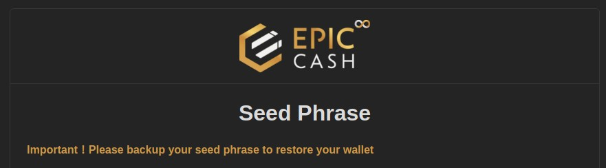

You should now see the Login page - enter your password and click Login. It may take a few
seconds for the login to complete.

Note: If this isn't your first run and you have more than one Account enter the Account name
you wish to work with. You can also create a different account here any time you login after
first run. Each wallet account will have a separate password and seed phrase. You cannot
transfer assets from one account to a different account using the wallet app as it can only
connect to one account at a time.

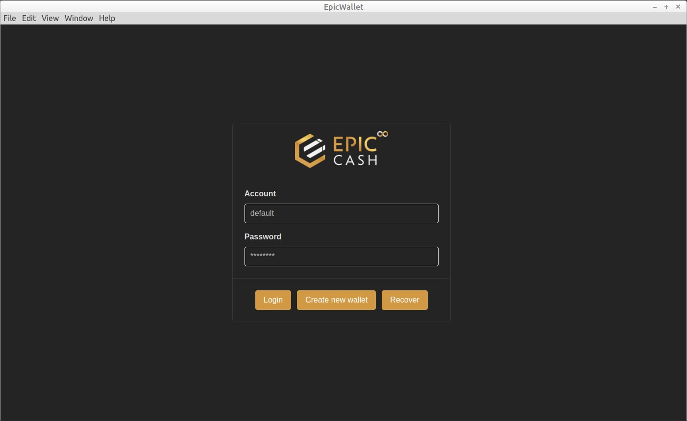

Now you are on the Setup Assistant page. Enter your "friendly" name (only used on
dashboard display) then click 'Next Step'. On the first Assistant page, you can click the Back
button to exit the Assistant without saving any changes. The 'Previous Step' button on the
other pages takes you back a page.

Now on Step 1, you can leave the default 'Built-in node server' or select 'External node server'
from the dropdown menu. Two possible external node servers are https://fastepic.eu:3413 and
https://epic-radar.com/node. Selecting an external node will save about 2Gb of disk space
and reduce your CPU load (while syncing) since the internal node must sync/download the
blockchain locally. It should sync in about two hours. You can also speed up using the Built-in
server the first time by downloading the blockchain and putting it in your .epic folder (for
advanced users). 

!!! note "Get latest blockchain data"
    [https://51pool.online/downloads/epic_chain_data.tar.gz](https://51pool.online/downloads/epic_chain_data.tar.gz)

**Recommended: use Built-in**

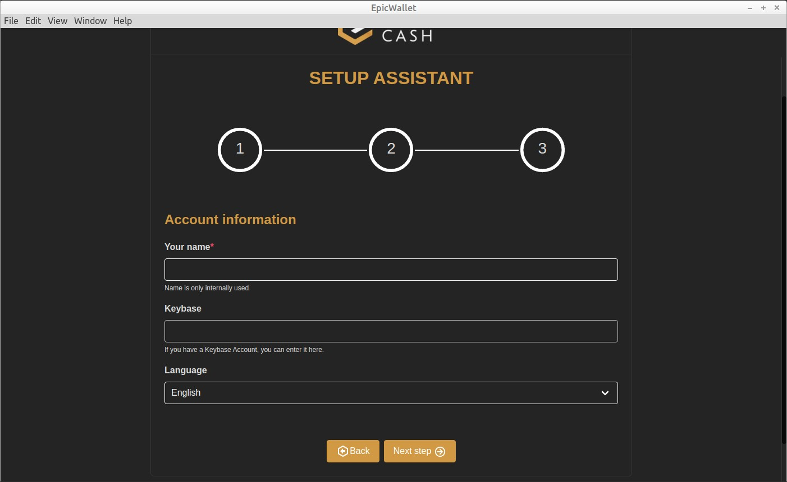

On the Step 2 page you will enter your ngrok Authtoken. Follow the instructions to go to
ngrok, set up an account, and copy your authtoken where you will paste it into the authtoken
field.

!!! note
    If you choose to not set up a ngrok account, you can turn on the option to use ngrok
    without an authtoken but be aware the ngrok address will change every two hours. You can
    also leave the authtoken field blank and leave the ngrok switch off to not use the ngrok
    service at all (requires port forwarding). Using an authtoken keeps the same address as long
    as the listener is running but changes every time you re-start the listener or wallet.

**Recommended: if you are not technical and this all makes no sense just leave
Authtoken blank and turn on 'use ngrok without' switch.**

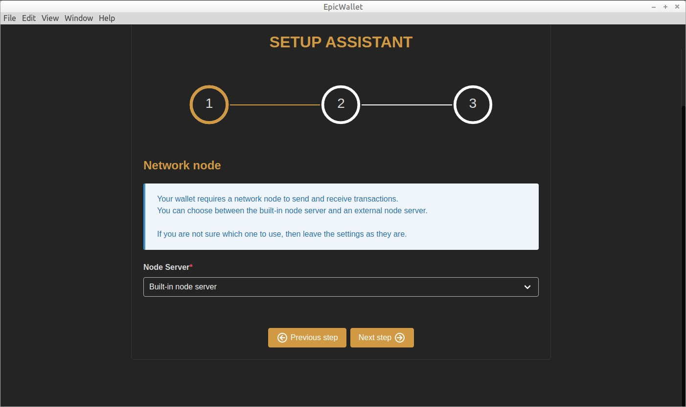

!!! info "Tech Note"
    Because of the way EPIC wallets talk to each other, they need to know where the
    receiver is located. Most likely you are running on a LAN on your router and outside
    computers can't see your particular PC address unless you set up 'Port Forwarding' on your
    router. This can be a challenging procedure for casual users, so ngrok works in the
    background to provide a special address that you can give to senders. This special address
    knows how to send incoming traffic to your specific private address through a process known
    as 'tunneling' by using the ngrok server as a forwarder.

In step 3 you will complete your settings by clicking 'Save and finish'

You are now on your Wallet Dashboard page.

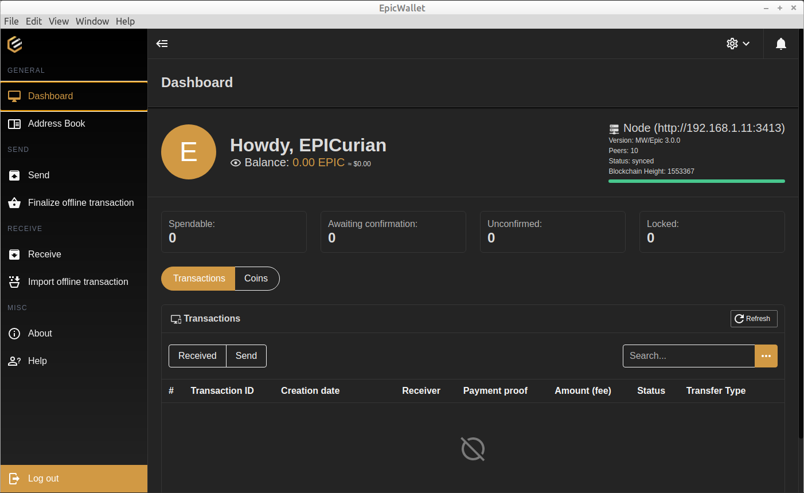

## EPIC Wallet Dashboard
### Address Book
Here you can search for entries or click the + button to add a new entry. Fill in the information
as needed. Use External Address 1 for static peer-to-peer Wallet addresses. Wallets that are
using ngrok will have the address change every time they start the wallet, so don't bother
putting these in your address book. You'll need to get them from the receiver every time you
send.

### Send
Enter the address of the wallet you wish to send to. 

Clicking on the + will take you to the `Address Book` where you can select the recipient. 

Click on the recipient name (if listed) and you will see addresses on the right - 
click on the copy icon next to the address you wish to use. 

Click on the Send Menu Option (on left) again and paste (right-click) the address you
copied. 

Once you have filled in the address you can add a message or leave blank. 

Enter the amount of EPIC you wish to send then click Send to initiate an instant peer-to-peer transfer.

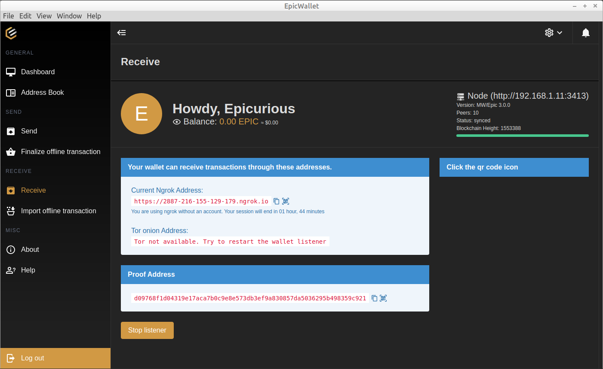

### Receive
Selecting Receive will show addresses you can give to a Sender or use on an Exchange.

- **Copy**: You can click on the Copy icon and share through email or Paste into Receiver field.

- **QRcode**: You can click on the QRcode icon and generate an image to scan with your phone
then paste the resulting text into a wallet or exchange app.

The Listener is on by default, but you can change this in Setup, however it must be on to send
or receive peer-ro-peer transfers. You can toggle it with the Stop/Start Listener button.

!!! note
    Your ngrok address willl change whenever you start your wallet or restart the listener or
    every 2 hours if not using an authtoken so make sure you copy or generate a QRcode just
    before you use it as a Receive Address on an exchange or send to other wallet user.

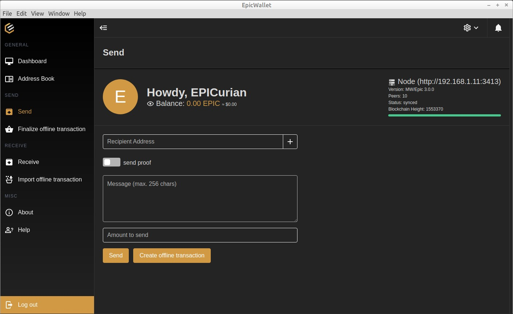

## Transaction Files
!!! note "How to use transaction files"
    Go to [:fontawesome-brands-medium: CLI Wallet Guide](https://medium.com/epic-cash/epic-cash-gui-wallet-tutorial-3992690f9d9) 
     and scroll down to 'Send and Receive with Transaction Files' for instructions.

## Settings
Pull down Setup Options (top right on Dashboard)

- Account

Enter or change your friendly name

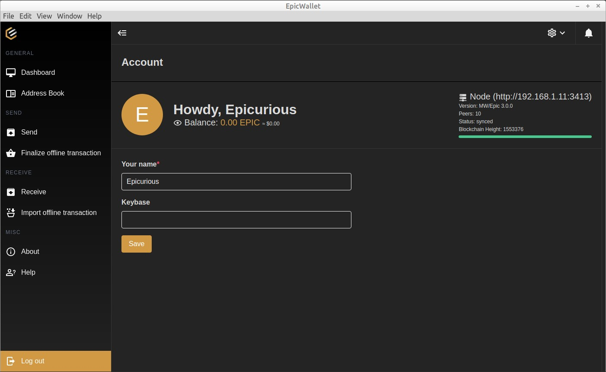

- Settings
- Select Built-in or External Node Server
- Enter External Node Server address
- Toggle Wallet Listener on startup
- Enter your ngrok Authtoken

Toggle start ngrok without Authtoken (no account at ngrok needed). The address created will
be valid for two hours so if you leave your wallet open longer your address will reset and you
must remember to copy the new address or rescan the QRcode just before using it as a
Receive Address or sending it to another wallet user. Be sure to inform the other wallet user
that it is only valid for two hours. If they can't send in that time frame, a new address will need
to be sent to them as it will have reset. If you leave this option off and create an account at
ngrok and enter your authtoken, your ngrok address will stay active the entire time you have
your listener running (basically while your wallet app is running if listener is set to auto start)
so there is no rush to send to this address.

**Recommended: if you are not technical and this all makes no sense just leave
Authtoken blank and turn on 'start ngrok without' switch.**

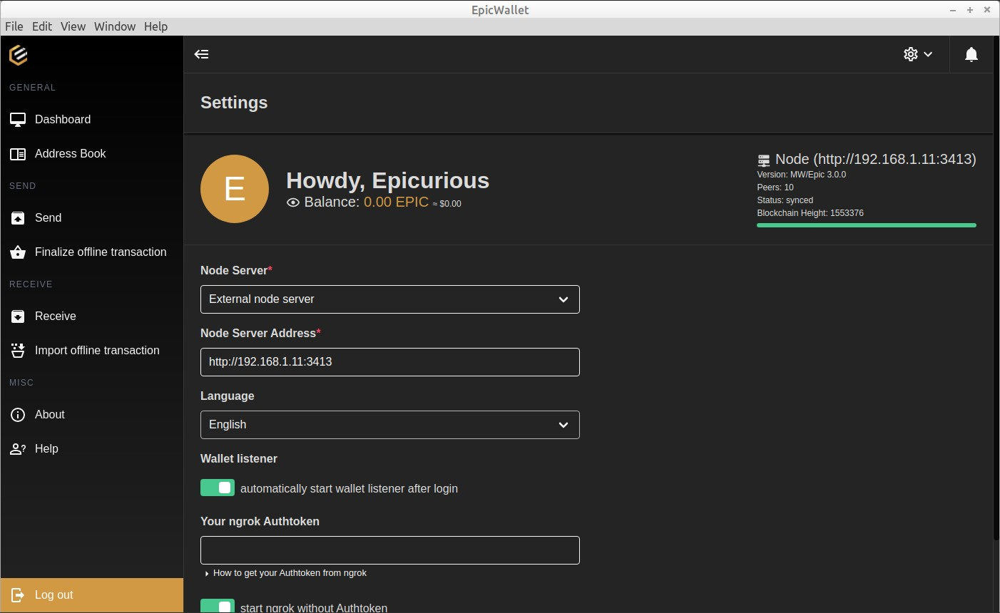

- Recheck Balance

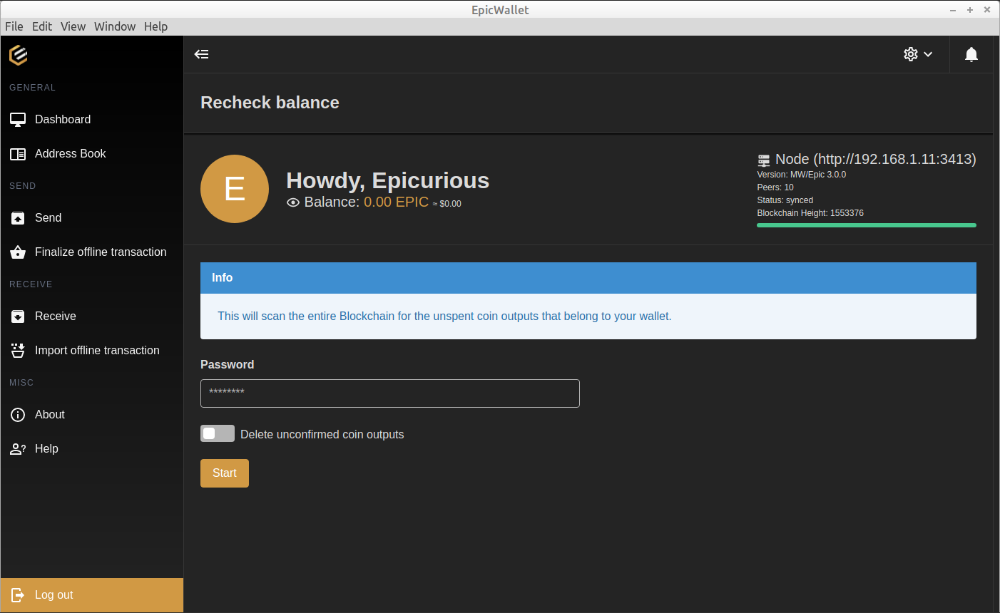

- Mnemonic Words

Displays your Seed Phrase to hand copy onto paper and a QRcode to scan and save as a
text string to media.

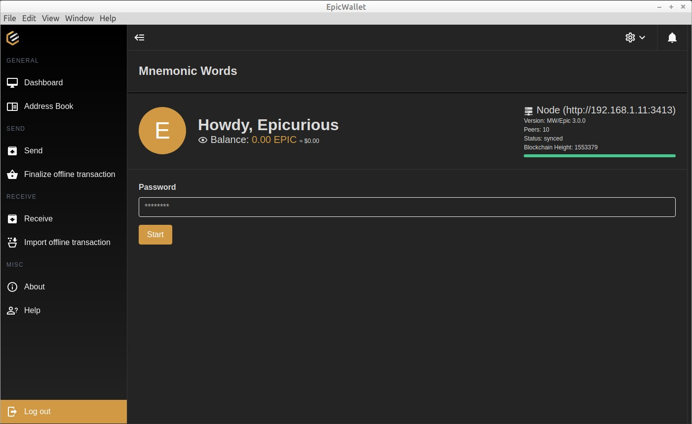

- Run Setup Assistant

- Re-run the Setup Assistant wizard

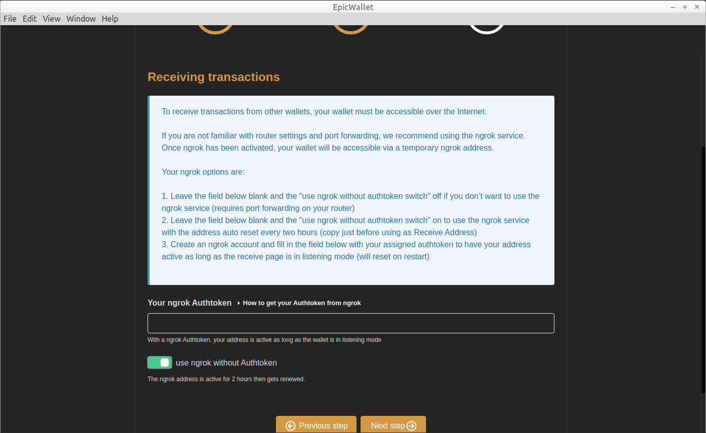

## Send/Receive with Addresses

!!! info
    Unlike other Crypto platforms, EPIC doesn't use wallet addresses as part of the privacy
    model. Your public internet wallet address is used between two wallets to transfer assets
    (your private wallet and private or exchange wallet). In order for one wallet to find the other
    wallet, the local address must be shared. You do this by copying the generated address and
    sending it to the other wallet user via email or SMS or use it as the Receiver address on an
    exchange when sending or withdrawing.

There are two methods for making your local address available for transfers: ngrok and Port
Forwarding.

Your ngrok options are:

1. Leave the authtoken field blank and the 'start ngrok without authtoken' switch OFF if
you don’t want to use the ngrok service (requires port forwarding on your router)
2. Leave the authtoken field blank and the 'start ngrok without authtoken' switch ON to
use the ngrok service with the address auto reset every two hours (copy just before using as
Receive Address)
3. Create an ngrok account and fill in the field below with your assigned authtoken to have
your address active as long as the receive page is in listening mode (will reset on restart)

If you do not want to create an account at ngrok or use the service without an authtoken, you
must set up Port Forwarding on your router:

- Access your router as admin
- Identify your router public IP address (assigned by your iSP)
- Identify your wallet PC's local IP address
- Locate the section for Port Forwarding
- Add an entry with you PC's address as Local Host and 3415 for external and internal
    port
- Use https://your-public-ip-address:3415 to share with other wallet user or use as the
    Receiver address on an exchange.

For an added layer of security you can use https://onetimesecret.com to generate a link to
your receive address, just enter your address and a password to generate. Share the
generated link and password with the sender via email or SMS (only works with private
wallets, not exchanges) and the sender must click on the link and enter the password to see
your actual receive address.

**Page Navigation:** you can scroll down on pages that continue off the bottom of the display.

