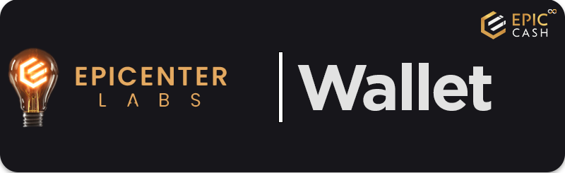

#


## Building and using CLI Wallet
- [:fontawesome-brands-github: **CLI Wallet Guide :octicons-link-external-16:**](https://github.com/EpicCash/documentation/wiki/Epic-wallet) - EPIC CLI Wallet Tutorial
- [:fontawesome-brands-github: **Build EPIC Wallet :octicons-link-external-16:**](https://github.com/EpicCash/epic-wallet/blob/master/doc/build.md) - Epic Wallet - Build, Configuration and Running

## Understand the Wallet implementation
- [**:material-web: RUST docs :octicons-link-external-16:**](https://docs.epic-radar.com/epic_wallet)
- [:fontawesome-brands-github: **Transaction UML :octicons-link-external-16:**](https://github.com/EpicCash/epic/blob/master/doc/wallet/transaction/basic-transaction-wf.png) - UML of an interactive transaction (aggregating transaction without `lock_height`)
- [:fontawesome-brands-github: **Wallet TLS setup :octicons-link-external-16:**](https://github.com/EpicCash/epic-wallet/blob/master/doc/tls-setup.md) - How to setup secure connection
- [:fontawesome-brands-github: **Wallet Design :octicons-link-external-16:**](https://github.com/EpicCash/epic-wallet/blob/emoji/doc/design/design.md) - Epic Wallet + Library Design

---

## GUI Desktop Wallet
> Author: :fontawesome-brands-telegram: [**Poolboy51**](https://t.me/poolboy51) | :material-web: [**eccence.digital** :octicons-link-external-16:](https://www.eccence.digital/)


- [:fontawesome-brands-github: GUI Wallet :octicons-link-external-16:](https://github.com/EpicCash/epic-gui-wallet) 
is an open-source electron application, layer of modern front-end interface for `epic-wallet cli`.
- Download **BETA GUI v5** here: [Linux, Windows, MacOS :octicons-link-external-16:](https://github.com/EpicCash/epic-gui-wallet/releases/tag/v5.0.2-beta) 

??? tip "Build your own development GUI wallet with NodeJS and Electron"
    ## Project setup
    ```
    git clone https://github.com/EpicCash/epic-gui-wallet.git
    cd epic-gui-wallet
    npm install 
    npm install -g electron --unsafe-perm=true --allow-root)
    ```
    
    ### Compiles and hot-reloads for development
    ```
    npm run electron:serve
    ```
    
    ### Compiles and minifies for production
    ```
    npm run electron:build
    ```
    
    ### Customize configuration
    See [Configuration Reference](https://cli.vuejs.org/config/).
    
    ### Customize epic-wallet version
    This project comes with a pre-built CLI epic-wallet, available in the relative path "resources/bin". If desired, you can compile and build an updated version of the [CLI epic-wallet project](https://github.com/EpicCash/epic-wallet) to replace the pre-built one.
    
    # Required deps
    ```
    NodeJs v17.9.0
    npm 8.5.5
    ```
    
    # Ubuntu
    ```
    sudo apt install libgtk-3-0 libgbm-dev
    ```
    
    # Troubleshooting
    
    ## Wallet can't authenticate to node API
    - Error code: 0x1645779384 - Request failed with status code 401;
      - Solution: Check if your Node API secret and path to file are correct;
    
    ## Node status is not accessible
    - Error code: 0x1645779384 - Request failed with status code 401;
      - Solution: Check if the node api is accessible via:
          - Mainnet: http://127.0.0.1:3413/v1/status
          - Usernet: http://127.0.0.1:23413/v1/status
    
    If the node is not accessible, you may need to either:
    - Start the server;
    
    Or, alternatively:
    - Open the `epic-server.toml` file located at your Epic home path (e.g., "C:\\Users\\\<username>\\.epic\\<main\floo\user>" in Windows) and update the `api_secret_path` variable to point to the `.api_secret` file located at the custom wallet directory;
      - Restart the server;
    
    # Version 3.0.0
    created and developed by eccence.digital (https://epicfundme.com/135-eccence-digital)
    
    # Donations
    Vitex Wallet EPIC Address:
    
    vite_aaac001cda9bd8e153789edefb6dc9a99ca6c37adc122692e9
