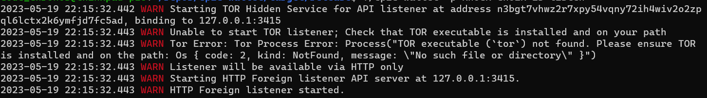

#

## Transaction Workflow Using CLI

1. Run the node server and ensure the node is synced to the latest block.

2. Start the HTTP Foreign Listener by using the command 
   
        ./epic-wallet -p <user's wallet password> listen

    The above command gives this output:

    

3. Use the below command to send Epic Cash to other wallets.
   
        ./epic-wallet -p <user's wallet password> send -d <receiver's address> <amount>

   The above command will look like the following when used with a real address and amount.

        ./epic-wallet -p <user's wallet password> send -d https://h11a-49-805-39-262.ngrok-free.app 2

4. For additional help and options use the following command:

        ./epic-wallet -p <user's wallet password> send -h
  
5. Both the sender's and receiver's wallets should be actively listening, and their node servers must be fully synced. If both wallets' nodes are operational at the same time ,the transaction will be completed within two hours.


## Transaction Workflow Using JavaScript

1. Run the node server and ensure the node is synced to the latest block.

2. Start the HTTP Owner Listener by using the command: 
   
        ./epic-wallet -p <user's wallet password> owner_api
        
    The above command gives this output:

    

3. Code Examples for JavaScript and Python to send Epic Cash to other wallets are given below.

    For the JavaScript code example:

    - In the line number 125, update value of the `dest` key with the receiver wallet's ngrok address.

    - In the line number 114, multiply the amount of Epic Cash you want to send with `10^8` and update value of the `amount` key with it. For example, we are sending `0.1` Epic Cash here, but the value of the `amount` key is `10000000`.

    For the Python code example:

    - In the line number 225, update value of the `dest` key with the receiver wallet's ngrok address.

    - In the line number 214, multiply the amount of Epic Cash you want to send with `10^8` and update value of the `amount` key with it. For example, we are sending `0.1` Epic Cash here, but the value of the `amount` key is `10000000`.

=== "NodeJS"
    NodeJS and NPM package manager is required
    
    ```shell
    npm i jayson
    ```

    ??? example "Sending Epic Cash code example"
        ~~~javascript title="send_tx_example.js" linenums="1"
        
        ~~~


    If the transaction is successful, you will see a response similar to the following in your terminal.


    ??? example "Sending Epic Cash response example"
        ~~~json title="send_tx_response_js.json" linenums="1"
        
        ~~~

=== "Python"
    Requires Python 3.10+ and following packages:

    ```shell
    python3 -m pip install coincurve pycryptodome requests
    ```

    ??? example "Sending Epic Cash code example"
        ~~~python title="send_tx_example.py" linenums="1"
        
        ~~~


    If the transaction is successful, you will see a response similar to the following in your terminal.


    ??? example "Sending Epic Cash response example"
        ~~~json title="send_tx_response_py.json" linenums="1"
        
        ~~~